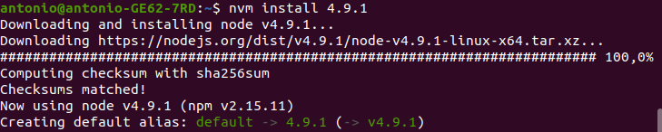
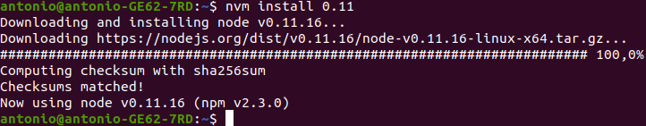
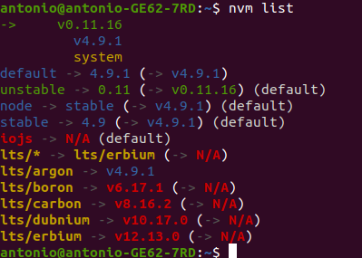
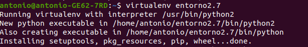
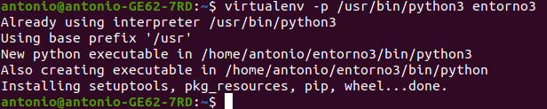
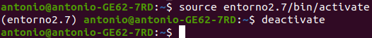
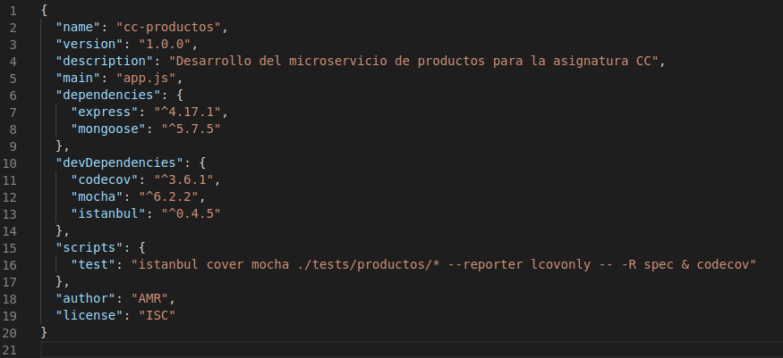

# Ejercicios del tema "Desarrollo basado en pruebas"

## Ejercicio 1: Instalar alguno de los entornos virtuales de node.js (o de cualquier otro lenguaje con el que se esté familiarizado) y, con ellos, instalar la última versión existente, la versión minor más actual de la 4.x y lo mismo para la 0.11 o alguna impar (de desarrollo)

### nvm para Node.js

Instalar nvm:

```bash
    curl -o- https://raw.githubusercontent.com/nvm-sh/nvm/v0.35.1/install.sh | bash
```

Listar todas las versiones LTS disponibles para descargar desde los repositorios oficiales de Node.

```bash
    nvm ls-remote --lts
```

Instalar la versión 4.9.1 y 0.11:

```bash
    nvm install <version>
```




Ver todas las versiones instaladas en el sistema:

```bash
    nvm list
```



Activar una versión específica.

```bash
    nvm use <version>
```

### virtualenv para Python

Instalar virtualenv

```bash
    apt-get install python-virtualenv
```

Crear entorno virtual con el interprete python 2.7

```bash
    virtualenv entorno2.7
```



Crear entorno virtual con python3:

```bash
    virtualenv -p /usr/bin/python3 entorno3
```



(Con la opción -p se indica el interprete que se va a utilizar en el entorno)  

Activar el entorno virtual:

```bash
    source entorno2.7/bin/activate
```

Desactivar el entorno virtual

```bash
    (entorno2.7)$ deactivate
```



## Ejercicio 2: Crear una descripción del módulo usando package.json. En caso de que se trate de otro lenguaje, usar el método correspondiente



Usaré como ejemplo el package.json que utilizo para el microservicio de gestión de productos que estoy desarrollando actualmente para el proyecto de gestión de pedidos en la asignatura de Cloud Computing del Máster de Ingeniería Informática.

Campos:

- **name**: Es el nombre del proyecto.
- **version**: versión actual del proyecto.
- **description**: Breve descripción del proyecto.
- **main**: El archivo principal.
- **dependencies**: Dependencias del proyecto en un entorno de producción.
- **devDependencies**: Son las dependencias necesarias en un entorno de de testing y desarrollo.
- **scripts**: Comandos que se podrán ejecutar. Por ejemplo con el comando npm test se ejecutarán los tests y se subirá el reporte de cobertura a codecov.
- **author**: Autor del proyecto.
- **license**: Licencia del proyecto. En mi caso ISC, que es una licencia de software libre permisiva.
