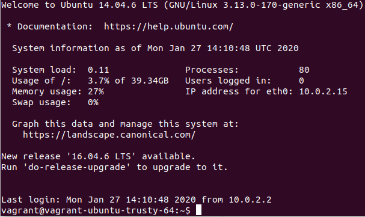
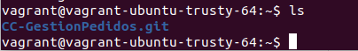

# Provisionamiento de máquinas virtuales

## Provisionar una máquina virtual en algún entorno con los que trabajemos habitualmente

Para provisionar una máquina virtual usaré la herramienta Vagrant.

Una vez instalada, para crear una máquina con una configuración sencilla, solo hay que indicar `vagrant init <imagen_box>`. En mi caso usaré una
imagen minimal de Ubuntu server.

```bash
    vagrant init aspyatkin/ubuntu-18.04-server
```

Esto creará el siguiente Vagrantfile:

```vagrantfile
Vagrant.configure("2") do |config|
    config.vm.box = "ubuntu/trusty64"
end
```

Con el que podemos levantar la máquina con:

```bash
    vagrant up
```

una vez creada se podrá conectar a ella a través de:

```bash
    vagrant ssh
```



## Descargar cualquier aplicación usando un playbook de Ansible

Para descargar el repositorio del proyecto de la asignatura he creado un **playbook.yml** con el que
instalo git y clono el repositorio de la asignatura:

```yml
---
  - hosts: ejerbox
    become: yes
  
    tasks:
      - name: Instalar git
        apt:
          name: git
  
  
      - name: Clonar repositorio
        git:
          repo: https://github.com/toniMR/CC-GestionPedidos.git
          dest: CC-GestionPedidos.git
```

Además he tenido que modificar el Vagrantifle:

```vagrantfile
Vagrant.configure("2") do |config|
    config.vm.box = "ubuntu/trusty64"

    config.vm.define "ejerciciosbox" do |gestionpedidos|
        config.vm.provision "ansible" do |ansible|
            ansible.inventory_path = "ansible_hosts.ini"
            ansible.playbook = "playbook.yml"
        end
    end
end
```

Si la máquina ya está creada solo tendremos que indicar para provisionar la máquina:

```bash
    vagrant provision
```

Si no, realizando `vagrant up` levantará la máquina y la provisionará automáticamente automáticamente.

Como se puede observar, accediendo a la máquina con ssh, el repositorio está clonado en la máquina:

